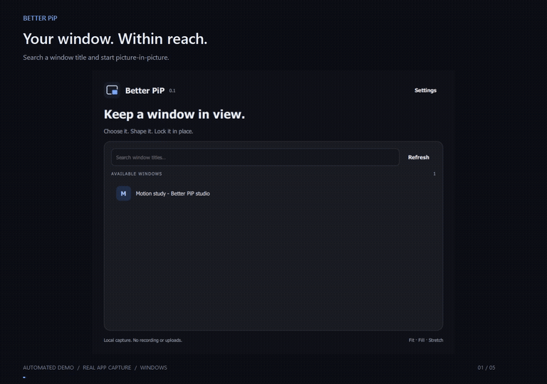
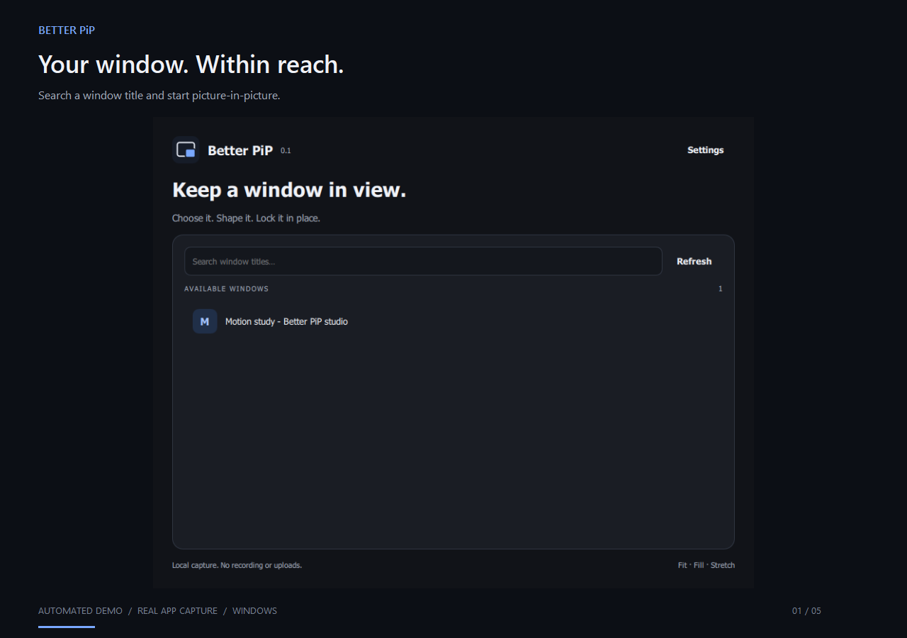
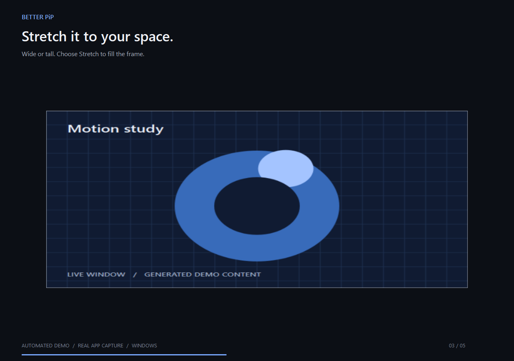
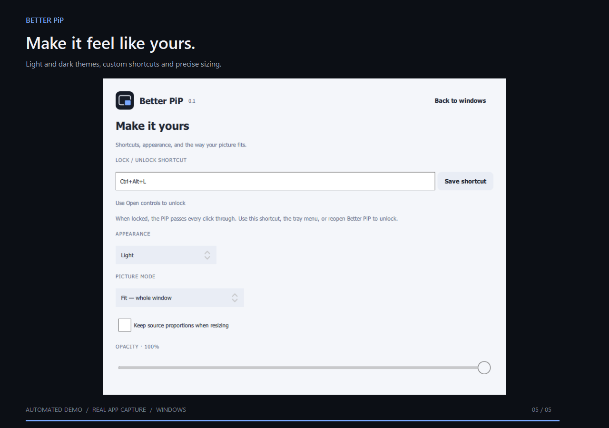

# Better PiP

A freely resizable picture-in-picture mirror for desktop windows, written in C++20 and Qt Quick.

[Download the preview](https://github.com/Relekto/better-pip/releases/tag/v0.1.0) · [Platform support](docs/platform-support.md) · [Architecture](docs/architecture.md)

## See it in action

[](docs/media/demo.mp4)

[Watch or download the 15-second MP4](https://github.com/Relekto/better-pip/blob/main/docs/media/demo.mp4).

Real Windows app captures with generated sample content and an automated feature sequence. The charcoal-and-blue appearance shown here is available on `main`; the v0.1.0 binaries still use the original palette. The lock scene shows the native locked state; physical click-through is covered by the separate desktop integration test.

| Charcoal | Free proportions | Light settings |
| --- | --- | --- |
|  |  |  |

Media can be reproduced with the optional [documentation studio](tools/presentation/README.md).

## Use

1. Open Better PiP and search for a window title. On Wayland, use the desktop's window chooser.
2. Select a window. Drag the PiP to move it and drag any edge or corner to resize it.
3. Choose **Fit**, **Fill**, or **Stretch** from the right-click menu. Width and height are independent unless you enable aspect preservation.
4. Press the lock button or **Ctrl+Alt+L** to freeze the PiP and pass clicks through it. On macOS the default uses Command+Option+L.
5. Use the same shortcut, the tray menu, or reopen Better PiP to unlock.

Settings include a shortcut recorder, exact dimensions, opacity, light/dark appearance, and aspect preservation. Capture stays on your computer. No account, recording, telemetry, or Python runtime is involved.

## Install

- **Windows 10 1903+ / Windows 11, x64:** run the per-user installer, or extract the portable ZIP and open `bin/better-pip.exe`.
- **macOS 13+, Apple Silicon or Intel:** choose the matching DMG and drag Better PiP into Applications. Allow Screen Recording when macOS requests it. The preview is not notarized.
- **Linux x64:** make the AppImage executable and run it. The portable archive starts with `./AppRun`. Packages target Ubuntu 22.04 or newer compatible systems; PipeWire and the desktop portals are needed on Wayland.

This is an unsigned preview. Windows capture, resizing, lock recovery, click-through hit testing, and the real video renderer have automated desktop coverage. macOS and Wayland still require real desktop qualification; see the support table for precise limits.

## Build

Install Qt **6.11.2** with Multimedia and Shader Tools, CMake 3.25+, Ninja, and a C++20 compiler. On Windows use an x64 Visual Studio 2022 developer terminal. Set `CMAKE_PREFIX_PATH` to the Qt SDK.

On Debian/Ubuntu, also install `libx11-dev libxext-dev libpipewire-0.3-dev libgl1-mesa-dev libxkbcommon-dev` and Qt's XCB runtime dependencies. macOS uses Xcode's compiler and SDK.

```sh
cmake --preset release
cmake --build --preset release
ctest --preset release
cmake --install build/release --prefix dist
```

The optional `desktop-test` executable opens only its own animated fixture and tests actual capture. Run it in a desktop session. CI also checks startup on Windows, macOS Intel/ARM, and Linux. CI dependency installers may use their own tooling.

## Contribute

Read [Contributing](CONTRIBUTING.md) and [Architecture](docs/architecture.md). Authored implementation files contain no comments; design reasoning belongs in documentation. Keep changes focused and add meaningful regression coverage for behavioral changes.

## License

Application source: MIT. [Dependency notices](THIRD_PARTY_NOTICES.md), corresponding dependency source archives, and replacement instructions accompany releases.
